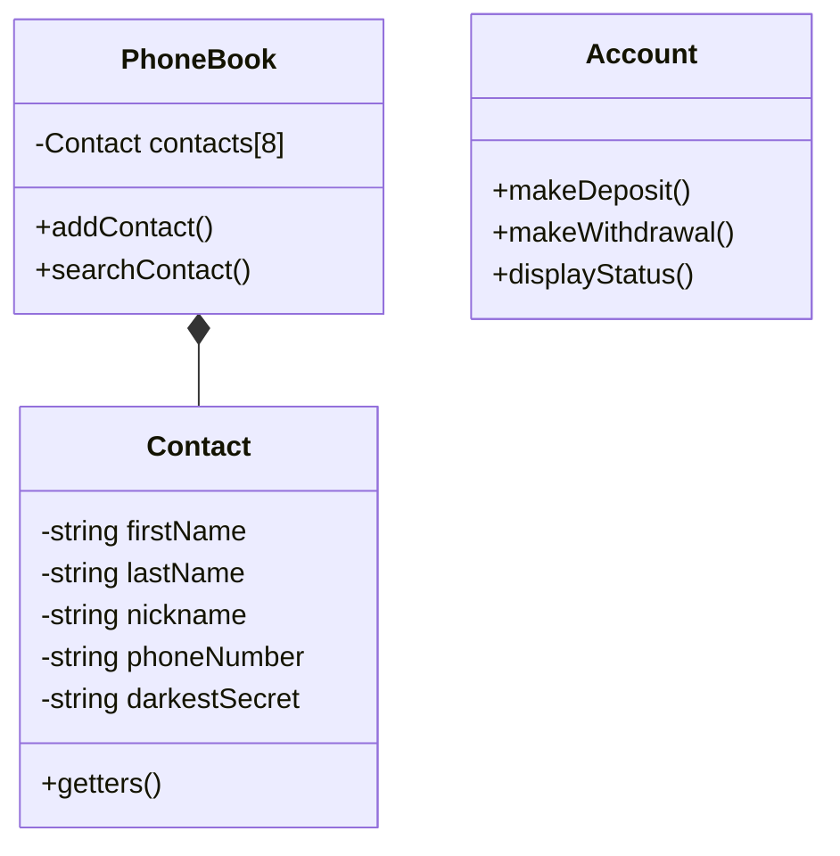
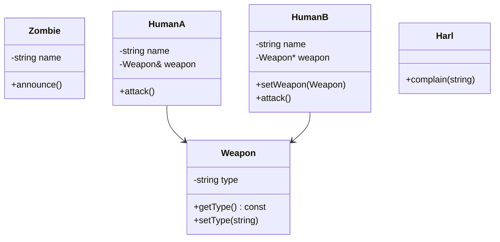
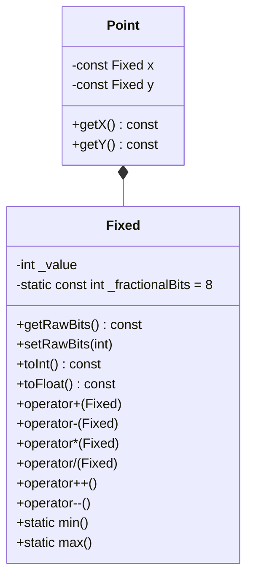
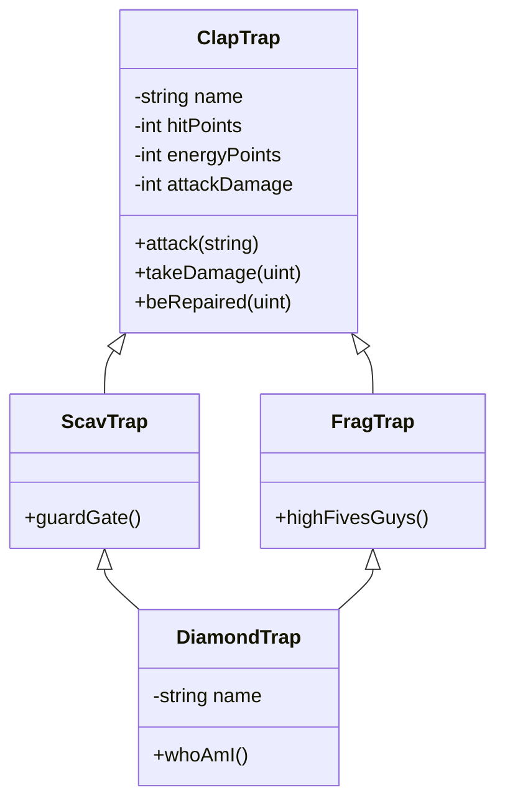
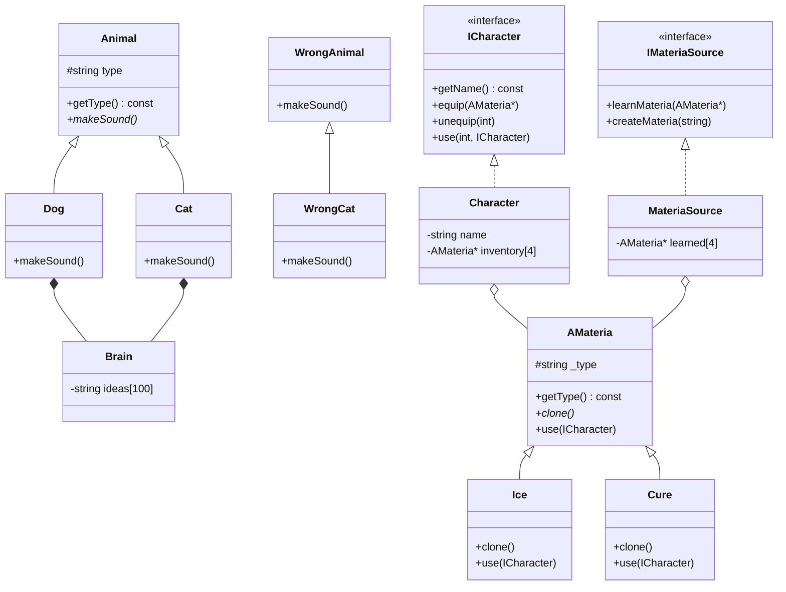

<table>
  <tr>
    <td align="center"> circle 0 </td>
    <td align="center"> circle 1 </td>
    <td align="center"> circle 2 </td>
    <td align="center"> circle 3 </td>
    <td align="center"> circle 4 </td>
    <td align="center"> circle 5 </td>
    <td align="center"> circle 6 </td>
  </tr>
  <tr>
    <td>

[**`libft`**](https://github.com/LLuisPP/42Cursus/tree/main/libft)
    </td>
    <td>

  [**`born2beRoot`**](https://github.com/LLuisPP/42Cursus/tree/main/Born2beRoot) 
  [**`ft_printf`**](https://github.com/LLuisPP/42Cursus/tree/main/ft_printf) 
  [**`get_next_line`**](https://github.com/LLuisPP/42Cursus/tree/main/get_next_line)
    </td>
    <td>

[**`push_swap`**](https://github.com/LLuisPP/42Cursus/tree/main/push_swap) 
[**`fractol`**](https://github.com/LLuisPP/42Cursus/tree/main/fractol) 
[**`pipex`**](https://github.com/LLuisPP/42Cursus/tree/main/pipex)
    </td>
    <td>

[**`philosophers`**](https://github.com/LLuisPP/42Cursus/tree/main/philosophers) 
[**`minishell`**](https://github.com/LLuisPP/42Cursus/tree/main/minishell)
    </td>
    <td>

[**`netpractice`**](https://github.com/LLuisPP/42Cursus/tree/main/netpractice) 
[**`cub3D`**](https://github.com/LLuisPP/42Cursus/tree/main/cub3D) 
[**`cpp0-4`**](https://github.com/LLuisPP/42Cursus/tree/main/cpp0-4)
    </td>
    <td>

[**`ft_irc`**]() 
[**`inception`**]() 
[**`cpp5-9`**]()
    </td>
    <td>

[**`trascendence`**]() 
    </td>
  </tr>
  <tr>
    <td></td>
    <td></td>
    <td>
      
[**`rank02`**](https://github.com/LLuisPP/42-Exams/tree/main/rank02)</td>
<td>
      
[**`rank03`**](https://github.com/LLuisPP/42-Exams-rank03)</td>
<td>
      
[**`rank04`**](https://github.com/LLuisPP/42-exams-rank04)</td>
<td>
      
[**`rank05`**]()</td>
<td>
  
[**`rank06`**]()</td>
  </tr>
</table>

<table>
  <tr>
    <td colspan="5" align="center">🏗️ C++ 0-4 🏗️</td>
  </tr>
  <tr>
    <td align="center">Project</td>
    <td align="center">Bonus</td>
    <td rowspan="2" align="center"></td>
  </tr>
  <tr>
    <td></td>
    <td></td>
  </tr>
</table>

| Module | Main target | Concepts to achieve | Evaluation keys |
| :- | - | - | - |
| **CPP00** | C++   First contact | - Basic syntax (namespace `std`)   - I/O (`std::cout`, `std::cin`)   - Class, methods & atributes   - Makefile & compilation   - Structure `.hpp/.cpp` | Project strcture C++98,  basic encapsulation,  cpp compile warnings,  naming & style norms. | 

  

 

  

| Module | Main target | Concepts to achieve | Evaluation keys |
| :- | - | - | - |
| **CPP01** | Memory management and object composition | - Constructors / destructors   - `new` / `delete` stack/heap diferencies  - Pointers and referencies  - Class composition (`HumanA`, `Weapon`, etc.)   - Methodos `const`| Object life cycle, ownership, passing by reference, memory leaks, interrelated objects behavior |

  

| Module | Main target | Concepts to achieve | Evaluation keys |
| :- | - | - | - |
| **CPP02** | Numerical types and overload operators | - Overload (`operator+ - * /`, `operator==`...)   - Copy constructor & `operator=` (Rule of 3)   - Members `const` y `static`   - Encapsulation |  Correct operator implementation, comprehension of copy/assign, const-correctness, encapsulation |

  

| Module | Main target | Concepts to achieve | Evaluation keys |
| :- | - | - | - |
| **CPP03** | Inerhit and specialization | - Simple inerhit (`: public`)   - Reuse of base codigo  - Methods overwrite  - Base constructir calls  - Different class behavior | Class hierarchy comprehension, behavior specialization, ctor/dtor chain, base-derivate distinction |

  

| Module | Main target | Concepts to achieve | Evaluation keys |
| :- | - | - | - |
| **CPP04** | Polimorfism and abstract classes | - **Virtual** functions and **dynamic overwrite**   - Virtual destructores  - Abstract clases (`= 0`)   - Composition (`Brain` in ex01) & deep copy   - **Interfaces and clone()** (ex03) | `Animal`, `Dog`, `Cat`, `Brain` (ex00–ex02)  `AMateria`, `Ice`, `Cure`, `ICharacter`, `MateriaSource` (ex03) | Real polimorfism in C++ (execution time), abstraction, dynamic memory management, deep copy, interface implementation |

  

