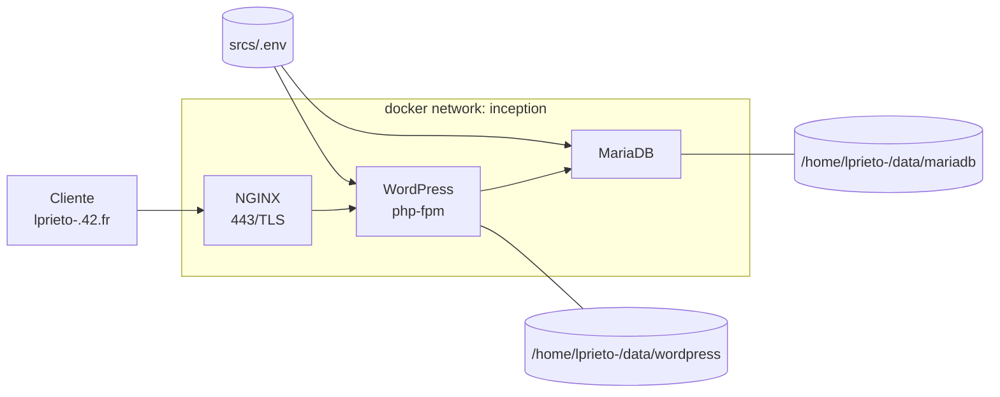

<table>
  <tr>
    <td align="center"> circle 0 </td>
    <td align="center"> circle 1 </td>
    <td align="center"> circle 2 </td>
    <td align="center"> circle 3 </td>
    <td align="center"> circle 4 </td>
    <td align="center"> circle 5 </td>
    <td align="center"> circle 6 </td>
  </tr>
  <tr>
    <td>

[**`libft`**](https://github.com/LLuisPP/42Cursus/tree/main/libft)
    </td>
    <td>

  [**`born2beRoot`**](https://github.com/LLuisPP/42Cursus/tree/main/Born2beRoot) 
  [**`ft_printf`**](https://github.com/LLuisPP/42Cursus/tree/main/ft_printf) 
  [**`get_next_line`**](https://github.com/LLuisPP/42Cursus/tree/main/get_next_line)
    </td>
    <td>

[**`push_swap`**](https://github.com/LLuisPP/42Cursus/tree/main/push_swap) 
[**`fractol`**](https://github.com/LLuisPP/42Cursus/tree/main/fractol) 
[**`pipex`**](https://github.com/LLuisPP/42Cursus/tree/main/pipex)
    </td>
    <td>

[**`philosophers`**](https://github.com/LLuisPP/42Cursus/tree/main/philosophers) 
[**`minishell`**](https://github.com/LLuisPP/42Cursus/tree/main/minishell)
    </td>
    <td>

[**`netpractice`**](https://github.com/LLuisPP/42Cursus/tree/main/netpractice) 
[**`cub3D`**](https://github.com/LLuisPP/42Cursus/tree/main/cub3D) 
[**`cpp0-4`**](https://github.com/LLuisPP/42Cursus/tree/main/cpp0-4)
    </td>
    <td>

[**`ft_irc`**]() 
[**`inception`**](https://github.com/LLuisPP/42Cursus/tree/main/inception) 
[**`cpp5-9`**]()
    </td>
    <td>

[**`trascendence`**]() 
    </td>
  </tr>
  <tr>
    <td></td>
    <td></td>
    <td>
      
[**`rank02`**](https://github.com/LLuisPP/42-Exams/tree/main/rank02)</td>
<td>
      
[**`rank03`**](https://github.com/LLuisPP/42-Exams-rank03)</td>
<td>
      
[**`rank04`**](https://github.com/LLuisPP/42-exams-rank04)</td>
<td>
      
[**`rank05`**]()</td>
<td>
  
[**`rank06`**]()</td>
  </tr>
</table>

<table>
  <tr>
    <td colspan="4" align="center">🧩 inception 🧩</td>
  </tr>
  <tr>
    <td align="center">Project</td>
    <td align="center">Bonus</td>
    <td rowspan="2" align="center"></td>
  </tr>
  <tr>
    <td></td>
    <td></td>
  </tr>
</table>

  

