<div align="center">

<div align="center">

<table>
  <tr>
    <td align="center"> circle 0 </td>
    <td align="center"> circle 1 </td>
    <td align="center"> circle 2 </td>
    <td align="center"> circle 3 </td>
    <td align="center"> circle 4 </td>
    <td align="center"> circle 5 </td>
    <td align="center"> circle 6 </td>
  </tr>
  <tr>
    <td>

[**`libft`**](https://github.com/LLuisPP/42Cursus/tree/main/libft)
    </td>
    <td>

  [**`born2beRoot`**](https://github.com/LLuisPP/42Cursus/tree/main/Born2beRoot)<br>
  [**`ft_printf`**](https://github.com/LLuisPP/42Cursus/tree/main/ft_printf)<br>
  [**`get_next_line`**](https://github.com/LLuisPP/42Cursus/tree/main/get_next_line)
    </td>
    <td>

[**`push_swap`**](https://github.com/LLuisPP/42Cursus/tree/main/push_swap)<br>
[**`fractol`**](https://github.com/LLuisPP/42Cursus/tree/main/fractol)<br>
[**`pipex`**](https://github.com/LLuisPP/42Cursus/tree/main/pipex)
    </td>
    <td>

[**`philosophers`**](https://github.com/LLuisPP/42Cursus/tree/main/philosophers)<br>
[**`minishell`**](https://github.com/LLuisPP/42Cursus/tree/main/minishell)
    </td>
    <td>

[**`netpractice`**](https://github.com/LLuisPP/42Cursus/tree/main/netpractice)<br>
[**`cub3D`**](https://github.com/LLuisPP/42Cursus/tree/main/cub3D)<br>
[**`cpp0-4`**](https://github.com/LLuisPP/42Cursus/tree/main/cpp0-4)
    </td>
    <td>

[**`ft_irc`**]()<br>
[**`inception`**](https://github.com/LLuisPP/42Cursus/tree/main/inception)<br>
[**`cpp5-9`**]()
    </td>
    <td>

[**`trascendence`**]()<br>
    </td>
  </tr>
  <tr>
    <td></td>
    <td></td>
    <td>
      
[**`rank02`**](https://github.com/LLuisPP/42-Exams/tree/main/rank02)</td>
<td>
      
[**`rank03`**](https://github.com/LLuisPP/42-Exams-rank03)</td>
<td>
      
[**`rank04`**](https://github.com/LLuisPP/42-exams-rank04)</td>
<td>
      
[**`rank05`**]()</td>
<td>
  
[**`rank06`**]()</td>
  </tr>
</table>

</div>

<div align="center">

<table>
  <tr>
    <td colspan="4" align="center">🧩 inception 🧩</td>
  </tr>
  <tr>
    <td align="center">Project</td>
    <td align="center">Bonus</td>
    <td rowspan="2" align="center"><a href="#"></a></td>
  </tr>
  <tr>
    <td><a href="#"></a></td>
    <td><a href="#"></a></td>
  </tr>
</table>

</div>
</div>

<div text-align="left">


  
</div>

<div text-align="left">


  
</div>

<div>

```mermaid

flowchart TD
    Client[Cliente] --> NGINX[NGINX]
    NGINX --> WORDPRESS[WordPress]
    WORDPRESS --> MARIADB[MariaDB]

    MARIADB --> ERR_DB["🚨 MariaDB caído → WordPress no puede usar la base de datos"]
    ERR_DB --> NGINX
    NGINX --> Client

    WORDPRESS --> ERR_WP["🚨 WordPress caído → NGINX responde pero sin contenido dinámico"]
    ERR_WP --> Client

    Client --> ERR_NGX["🚨 NGINX caído → no hay entrada al sistema"]



```

*This project has been created as part of the 42 curriculum by lprieto-.*

# Inception

## Description

**Inception** is a system administration project from the 42 curriculum designed to provide a deep and practical understanding of **Docker**, **Docker Compose**, and modern container-based infrastructures.

The objective of the project is not only to run services inside containers, but to **understand why Docker is used, how it works internally, and which problems it solves** compared to traditional virtualization or monolithic setups.

The project deploys a complete and secure **WordPress infrastructure**, fully containerized, running inside a **Virtual Machine**, and respecting strict rules regarding security, networking, persistence, and configuration.


## Why Docker?

Docker is used in this project because it provides:

- **Service isolation**  
  Each service runs in its own container with its own filesystem, processes, and configuration.

- **Reproducibility**  
  The infrastructure can be rebuilt at any time in an identical state.

- **Lightweight virtualization**  
  Containers share the host kernel, unlike virtual machines, making them faster and more resource-efficient.

- **Explicit dependencies**  
  Each service declares exactly what it needs through its Dockerfile.

- **Controlled networking**  
  Services communicate only through defined Docker networks.


## Docker Functionalities Used

This project makes use of several core Docker features:

- **Dockerfiles**  
  Custom images are built from Alpine or Debian base images.

- **Docker Compose**  
  Orchestrates multi-container setup, networking, volumes, and restart policies.

- **Docker Networks**  
  Isolates internal traffic and allows service-name-based communication.

- **Docker Volumes**  
  Ensures data persistence across container restarts and rebuilds.

- **Environment Variables & Secrets**  
  Externalize configuration and protect sensitive data.

- **Restart Policies**  
  Containers restart automatically in case of failure.


## Architecture Overview

The infrastructure is composed of three mandatory services, each running in its own container.

### NGINX
- Single public entry point
- Exposes HTTPS on port **443**
- Uses **TLSv1.2 or TLSv1.3 only**
- Proxies requests to WordPress (PHP-FPM)
- No PHP or database installed

### WordPress + PHP-FPM
- Runs WordPress using PHP-FPM only
- No embedded web server
- Receives traffic only from NGINX
- WordPress files stored in a persistent volume

### MariaDB
- Database backend for WordPress
- No web server or unnecessary services
- Data stored in a dedicated volume
- Initialized using environment variables and/or secrets


## Docker Networking

A **custom Docker network** connects all containers.

- Containers resolve each other using **service names**
- No usage of `network: host`, `--link`, or `links`
- Only NGINX exposes a port to the host
- Internal ports remain private

This ensures proper isolation and security.


## Data Persistence

Two Docker volumes are used:

- **WordPress volume**  
  Persists `/var/www/html`

- **MariaDB volume**  
  Persists database files

Volumes are mounted under:

```
/home/<login>/data
```

as required by the subject.

---

## Project Structure

```

├── Makefile
├── USER_DOC.md
├── DEV_DOC.md
├── srcs/
│   ├── docker-compose.yml
│   └── requirements/
│       ├── mariadb/
│       ├── nginx/
│       └── wordpress/

```


Each service directory contains:
- Dockerfile
- An entrypoint script
Not all services require static configuration files.
NGINX requires a custom configuration file, while MariaDB and WordPress are configured dynamically at runtime using environment variables and initialization scripts through the entrypoint, which keeps the setup simple, explicit, and compliant with the subject.


## Instructions

### Requirements

- Linux Virtual Machine
- Docker
- Docker Compose
- Make

### Build and Start the Project

```bash
make
```

This command:
- Builds all images from scratch
- Creates Docker networks and volumes
- Starts the full infrastructure


### Stop Containers

```bash
make down
```


### Rebuild Everything

```bash
make re
```


---

## Peer Evaluation – Testing Commands

These commands are commonly used during **peer evaluation** to verify correctness.

### Check running containers

```bash
docker ps
docker images
docker network ls
docker volume ls
docker logs nginx
docker logs wordpress
docker logs mariadb
docker exec -it nginx sh
docker exec -it wordpress sh
docker exec -it mariadb sh
openssl s_client -connect <login>.42.fr:443

```

### Check images built locally (no forbidden images)

```bash
docker images
```

### Inspect Docker network

```bash
docker network ls
docker network inspect inception_network
```

### Verify volumes

```bash
docker volume ls
docker volume inspect wordpress_data
docker volume inspect mariadb_data
```

### Check logs

```bash
docker logs nginx
docker logs wordpress
docker logs mariadb
```

### Access containers

```bash
docker exec -it nginx sh
docker exec -it wordpress sh
docker exec -it mariadb sh
```

### Verify TLS

```bash
openssl s_client -connect <login>.42.fr:443
```

### Verify WordPress database connection

```bash
docker exec -it mariadb mariadb -u <db_user> -p
```

### Restart containers (crash recovery test)

```bash
docker stop wordpress
docker ps
```

Container should restart automatically.


## Environment Variables and Secrets

### Environment Variables
Stored in `.env`:
`````
MYSQL_HOST=mariadb
MYSQL_DATABASE=wordpress
MYSQL_USER=wpuser

DOMAIN_NAME=<login>.42.fr
WP_TITLE=Inception

WP_ADMIN=<admin_user>
WP_ADMIN_EMAIL=<admin_email>

WP_USER=<user>
WP_USER_EMAIL=<user_email>
`````

- Domain name
- Database name
- Database user
- WordPress configuration

### Secrets
- Passwords are stored in `secrets/`
- Never hardcoded
- Never committed to git
- Can be mounted as Docker secrets


## Mandatory Comparisons

### Virtual Machines vs Docker

<div align=center>

||Virtual Machines|Docker||
|---|---|---|---|
|◇|Full OS per instance|Shares the host kernel|◇|
|❌|Heavy resource usage|Lightweight and efficient|✅|
|❌|Slower boot time|Near-instant startup|✅|
|◇|Hardware-level virtualization|OS-level virtualization|◇|
|❌|Suitable for running different OS|Ideal for microservices|✅|

Docker is recommended when lightweight, fast, and reproducible service deployment is required, especially for microservice-based architectures where running a full operating system per service would be unnecessary overhead.
</div>


### Secrets vs Environment Variables

<div align=center>

||Secrets|Environment Variables||
|---|---|---|---|
|✅|Encrypted|Plain text|❌|
|✅|Designed for sensitive data|Plain text configuration|❌|
|✅|Access controlled per service|Accessible to all processes|❌|
|◇|Not stored in images or repo|Often stored in .env|◇|
|✅|More secure for credentials|Intended for non-sensitive data|❌|
|✅|Recommended for production secrets|Simpler but less secure|❌|

Docker Secrets are recommended for managing sensitive information such as passwords and credentials, while environment variables should be reserved for non-sensitive configuration data.
</div>


### Docker Network vs Host Network

<div align=center>

||Docker Network|Host Network||
|---|---|---|---|
|✅|Isolated container networking|No network isolation|❌|
|✅|Services communicate by name|Containers share host network|❌|
|✅|Better security|Higher security risks|❌|
|◇|Predictable and controlled|Harder to manage|◇|
|✅|Required by the subject|Explicitly forbidden|❌|

Docker networks are recommended because they provide isolated, secure, and predictable communication between services, which is a mandatory requirement for this project.
</div>


### Docker Volumes vs Bind Mounts

<div align=center>
  
||Docker Volumes|Bind Mounts||
|---|---|---|---|
|✅|Managed by Docker|Managed by host filesystem|❌|
|✅|Portable across systems|Host-path dependent|❌|
|◇|Safer for production|Mainly for development|◇|
|✅|Easy backup and migration|Harder to maintain|❌|
|✅|Recommended by the subject|Not recommended here|❌|

Docker volumes are recommended for production environments because they ensure portable, reliable, and Docker-managed data persistence independent of the host filesystem structure.
</div>


## AI Usage

AI tools were used to:
- Clarify Docker concepts
- Help structure documentation
- Summarize official documentation

All generated content was reviewed, understood, and validated by the author.


## Resources

- Docker Documentation  
  https://docs.docker.com/

- Docker Compose  
  https://docs.docker.com/compose/

- NGINX  
  https://nginx.org/en/docs/

- WordPress  
  https://wordpress.org/documentation/


## Notes

- No pre-built images were used
- `latest` tag is forbidden and not used
- Containers restart automatically
- NGINX is the only public entry point
- No infinite loops or hacky entrypoints


`````

MYSQL_HOST=mariadb
MYSQL_DATABASE=wordpress
MYSQL_ROOT_PASSWORD=rootsql
MYSQL_USER=wpuser
MYSQL_PASSWORD=wppass

DOMAIN_NAME=lprieto-.42.fr
WP_TITLE=Inception

WP_ADMIN=lprieto-42
WP_ADMIN_PASSWORD=luispass123
WP_ADMIN_EMAIL=luisadmin@example.com

WP_USER=luis
WP_USER_PASSWORD=luispass123
WP_USER_EMAIL=luis@example.com

`````


  
</div>


